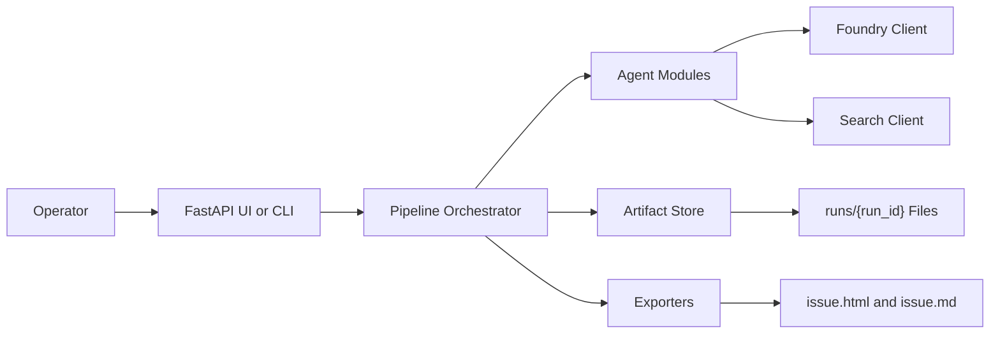
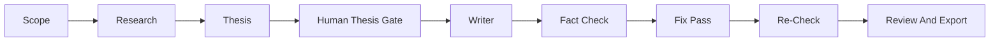
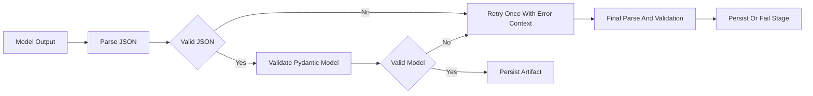

# The Augmented Investor - Technical Design Document

**Version:** 1.0  
**Last Updated:** 2026-05-11

---

## 1. Overview

### 1.1 Purpose

This document describes the technical design for rewriting The Augmented Investor from a
single-file HTML proof of concept into a Python application with a modular agent pipeline,
Azure AI Foundry integration, persisted run artifacts, validated data contracts, and
testable source-quality logic.

This design implements the requirements in `DOCS/SPEC.md` and follows the repository
guidance in:

- `DOCS/AI_GUIDE.md` for context priority, small focused functions, clear errors, and
  documentation expectations.
- `DOCS/TDD_GUIDE.md` for test structure, fixtures, mocking, and test-alongside
  development.
- `DOCS/CODE-QUALITY.md` for Radon complexity and maintainability reporting.

### 1.2 Scope

The first production-oriented slice will provide:

- A Python backend pipeline for Scope, Research, Thesis, Writer, Fact Check, Fix Pass,
  Re-Check, and Export stages.
- A minimal FastAPI UI or CLI for running the workflow.
- Azure AI Foundry Anthropic Messages integration.
- A Foundry smoke test before full provider use.
- A search/retrieval abstraction that can use Foundry tools or an external provider.
- Pydantic models for all stage contracts.
- JSON run artifacts stored on disk.
- HTML and Markdown export.
- Unit tests with mocked model/search clients by default.

The first slice will not include authentication, multi-user storage, a database, or
automated newsletter publishing.

---

## 2. Architecture Overview

### 2.1 High-Level Architecture



### 2.2 Pipeline Flow



The orchestrator owns stage ordering and state transitions. Agents are small modules that
either call a provider client or run deterministic business logic. Every completed stage
is persisted before the next stage begins.

### 2.3 Component Description

| Component | Purpose | Technology |
|-----------|---------|------------|
| UI or CLI | Collect scope, show thesis approval, run stages, show review/export actions. | FastAPI server-rendered pages or Python CLI |
| Pipeline Orchestrator | Enforce stage order, call agents, persist outputs, handle retries. | Python |
| Agent Modules | Implement Research, Thesis, Writer, Fact Check, and Fix Pass behavior. | Python, prompt templates |
| Foundry Client | Centralize Azure AI Foundry request construction, response parsing, and safe metadata. | `httpx`, Pydantic |
| Search Client | Abstract web/source retrieval so research does not depend on model-side browsing. | Python interface, provider adapters |
| Artifact Store | Read and write run artifacts under `runs/{run_id}/`. | Local file system, JSON |
| Pydantic Models | Validate stage inputs and outputs. | `pydantic` |
| Exporters | Write final issue files. | Python Markdown/HTML helpers |
| Tests | Verify contracts, orchestration, provider adapters, and fact-check logic. | `pytest`, mocked clients |

---

## 3. Technology Stack

| Category | Technology | Purpose |
|----------|------------|---------|
| Language | Python 3.11+ | Primary implementation language |
| API/UI | FastAPI | Minimal web interface and API routes |
| CLI | Python standard library or Typer if justified | Optional fast vertical-slice operator interface |
| Validation | Pydantic | Data contracts for stage inputs and outputs |
| Settings | `pydantic-settings` | Environment-based configuration |
| HTTP Client | `httpx` | Foundry and search provider calls |
| Testing | `pytest` | Unit and integration testing |
| Mocking | `pytest-mock` or standard `unittest.mock` | Mock Foundry and search providers |
| Quality | Radon | Cyclomatic complexity and maintainability index |
| Persistence | Local JSON files | Initial run artifact storage |

No database is required for the first implementation. If a database is added later, design
it separately and assume SQL Server for database language and examples.

---

## 4. Directory Structure

```text
TheAugmentedInvestor/
  src/
    augmented_investor/
      __init__.py
      app.py
      cli.py
      config.py
      foundry_client.py
      external_search_client.py
      models/
        __init__.py
        scope.py
        research.py
        thesis.py
        draft.py
        fact_check.py
        run_artifact.py
      agents/
        __init__.py
        research_agent.py
        thesis_agent.py
        writer_agent.py
        fact_check_agent.py
        fix_pass_agent.py
      pipeline/
        __init__.py
        orchestrator.py
        artifact_store.py
        json_parser.py
      prompts/
        research.md
        thesis.md
        writer.md
        fact_check.md
        fix_pass.md
      exporters/
        __init__.py
        markdown_exporter.py
        html_exporter.py
  tests/
    __init__.py
    conftest.py
    unit/
    integration/
  DOCS/
    SPEC.md
    DESIGN.md
    CODE-QUALITY.md
    TDD_GUIDE.md
    AI_GUIDE.md
  runs/
    .gitkeep
  example.env
  requirements.txt
  requirements-dev.txt
  README.md
```

### 4.1 Directory Notes

- `runs/` is runtime output. It should not contain secrets and should generally be
  excluded from source control except for a placeholder file if needed.
- `prompts/` contains prompt templates so prompt wording does not live inside orchestration
  code.
- `models/` owns structured contracts. Agents and pipeline code should depend on these
  contracts instead of passing raw dictionaries across boundaries.
- `pipeline/json_parser.py` owns deterministic JSON parsing, validation, and retry support.

---

## 5. Data Design

### 5.1 Persistence Strategy

Initial persistence is file-based JSON. This keeps the workflow inspectable and avoids
premature database design while the agent contracts are still evolving.

Each run creates a folder:

```text
runs/{run_id}/
  00_scope.json
  01_research.json
  02_thesis.json
  03_draft.json
  04_fact_check.json
  05_fixed_draft.json
  06_recheck.json
  issue.html
  issue.md
```

The run folder may also include safe metadata files such as raw model outputs and provider
timings. It must not include API keys, full secrets, or the real `.env` contents.

### 5.2 Core Models

The exact model fields will be finalized in code, but the model boundaries are fixed by
`DOCS/SPEC.md`.

| Model | Purpose | Key Fields |
|-------|---------|------------|
| `ScopeRequest` | Validated operator input. | market, recentWindow, contextWindow, readerHorizon, readerType, contrarianLean, depth, length |
| `ResearchBrief` | Structured evidence and retrieval metadata. | claims, evidence, sources, sourceQuality, confidence, retrievedContent |
| `ThesisBrief` | Approved editorial argument. | centralThesis, thesisBasis, bullCase, baseCase, bearCase, scenarioMath, confidenceRationale |
| `DraftIssue` | Generated article. | subject, title, subtitle, lede, bodyHtml, sourcesUsed, wordCount |
| `FactCheckReport` | Structured audit output. | flags, triageBuckets, sourceQualitySummary, overallScore |
| `RunArtifact` | Artifact metadata. | runId, stageName, path, createdAt, status, modelMetadata |

### 5.3 Source Evidence Model

Research evidence should store enough context for deterministic checks when retrieval is
available.

```text
SourceEvidence
  sourceUrl: str
  title: str | None
  publisher: str | None
  publishedAt: datetime | None
  retrievedAt: datetime
  retrievedText: str | None
  excerpt: str | None
  quotedEvidence: str | None
  sourceQuality: SourceQuality
  supportsExactClaim: bool
```

### 5.4 Source Quality Values

The supported source-quality categories are:

- `primary_market_data`
- `company_filing_or_ir`
- `official_institutional_report`
- `reputable_financial_media`
- `syndicated_market_article`
- `blog_or_substack`
- `unknown`

Fact Check must preserve the rule that a citation is not proof by itself.

### 5.5 Fact Check Flag Contract

Fact-check flags must preserve the prototype's structured metadata so the UI, Fix Pass,
and Re-Check can make deterministic decisions.

```text
FactCheckFlag
  category: unsupported_number | missing_url | instrument_imprecision |
    overconfident_projection | missing_counterargument | investment_advice |
    scenario_math_unlabeled | weak_source_for_quant_claim |
    source_does_not_support_claim | source_quality_mismatch |
    unverified_market_return | overrelies_on_blog_or_substack |
    exact_quote_missing | citation_present_but_claim_unproven | ok
  severity: error | warning | info | ok
  excerpt: str
  issue: str
  suggestion: str
  claimType: market_return | valuation | company_financial |
    institutional_report | macro_data | forecast | scenario_math |
    editorial_interpretation
  requiredSourceQuality: SourceQuality | any
  actualSourceQuality: SourceQuality | none
  verificationStatus: verified | partially_supported | unsupported | needs_primary_source
  triage: fixableWithExistingResearch |
    generalizeOrRemoveUnsupportedSpecificity | needsResearchAddendum
  addendumQuery: str | None
```

`FactCheckReport.sourceQualitySummary` must include `weakSourceFlags`,
`unverifiedQuantClaims`, `blogOnlyClaims`, and `overallSourceQuality`.

### 5.6 Source Quality Rules By Claim Type

| Claim Type | Required Support | Failure Behavior |
|------------|------------------|------------------|
| `market_return` | Primary market data, filing/IR, or reputable financial media. | Syndicated-only support is `weak_source_for_quant_claim`. |
| `valuation` | Primary market data or filing/IR. | Syndicated, blog/Substack, unknown, or none is insufficient. |
| `company_financial` | Company filing/IR or reputable financial media. | Lower-quality support is a source-quality mismatch. |
| `institutional_report` | Exact report title, publisher, and date. | Missing metadata is `exact_quote_missing`. |
| `forecast` | Clear forecast framing. | Overstated certainty is flagged. |
| `scenario_math` | Explicit scenario estimate label. | Missing label is `scenario_math_unlabeled`. |
| `editorial_interpretation` | Any source quality, but framed as opinion. | Unsupported factual framing is flagged. |

Plain-text footnote URLs count as valid citations. Valid restatements, unit conversions,
and reasonable roundings of cited figures are `ok` when traceable to research evidence.

---

## 6. API And Internal Interface Design

### 6.1 Orchestrator Interface

| Function | Parameters | Returns | Description |
|----------|------------|---------|-------------|
| `refine_scope()` | `ScopeRequest` | `ScopeRequest` | Validate and normalize scope input. |
| `run_research()` | `runId`, `ScopeRequest` | `ResearchBrief` | Produce research and source evidence. |
| `run_thesis()` | `runId`, `ResearchBrief` | `ThesisBrief` | Generate structured thesis. |
| `approve_thesis()` | `runId`, approval payload | `RunArtifact` | Persist thesis approval state. |
| `write_draft()` | `runId`, `ThesisBrief`, `ResearchBrief` | `DraftIssue` | Generate article draft. |
| `fact_check_draft()` | `runId`, `DraftIssue`, `ResearchBrief` | `FactCheckReport` | Audit claims and source quality. |
| `apply_fix_pass()` | `runId`, `DraftIssue`, `FactCheckReport` | `DraftIssue` | Repair flagged issues. |
| `recheck_draft()` | `runId`, fixed `DraftIssue`, `ResearchBrief` | `FactCheckReport` | Re-run fact check after fixes. |
| `export_issue()` | `runId`, final `DraftIssue` | export paths | Write HTML and Markdown files. |

Function names are lower snake case to match Python conventions. Internal variables in
implementation should follow the project/user convention chosen for the codebase when
implementation begins.

### 6.2 Provider Client Interface

`FoundryClient` should expose a small API:

```text
send_message(request: FoundryMessageRequest) -> FoundryMessageResponse
smoke_test(includeToolProbe: bool = True) -> FoundrySmokeTestResult
```

Responsibilities:

- Build Foundry endpoint paths in one place.
- Add required headers without leaking secrets.
- Support role-based model/deployment selection.
- Apply timeouts.
- Return parsed text, raw safe metadata, usage data if available, and provider diagnostics.
- Never log or persist API keys.

### 6.3 Search Client Interface

Search must be abstract so the Research Agent can work with different provider choices.

```text
search(query: str, limit: int) -> list[SearchResult]
retrieve(url: str) -> SourceEvidence
```

Initial adapters:

- `NoopSearchClient` for tests and offline development.
- `FoundryToolSearchClient` only if the smoke test confirms tool support.
- `ExternalSearchClient` for a later approved provider such as Bing Search API, Tavily,
  SerpAPI, or Exa.

### 6.4 Operator Interface Strategy

The first implemented operator interface is CLI-based. It calls the artifact store,
orchestrator, operator-interface helpers, and exporters directly. This keeps the workflow
usable while provider integration and JSON contracts stabilize.

The next operator interface should be a local FastAPI GUI over the same backend helpers.
The GUI must not duplicate workflow logic or bypass persisted run artifacts.

CLI command coverage:

| Command | Purpose |
|---------|---------|
| `create-run` | Create a run from scope JSON input. |
| `run-research` | Run the Research Agent. |
| `run-thesis` | Run the Thesis Agent. |
| `approve-thesis` | Persist thesis approval. |
| `reject-thesis` | Persist thesis rejection. |
| `write-draft` | Run the Writer Agent. |
| `fact-check` | Run fact-check stage. |
| `apply-fix-pass` | Apply fix pass. |
| `recheck` | Run re-check against fixed draft. |
| `review-run` | Display current draft, sources, fact-check state, and export options. |
| `export-run` | Write `issue.html` and `issue.md`. |

### 6.5 FastAPI Route Shape

The GUI can be server-rendered pages with form actions or JSON endpoints. A minimal route set:

| Route | Method | Purpose |
|-------|--------|---------|
| `/runs` | POST | Create a run from scope input. |
| `/runs/{runId}` | GET | View run status and artifacts. |
| `/runs/{runId}/research` | POST | Run research stage. |
| `/runs/{runId}/thesis` | POST | Run thesis stage. |
| `/runs/{runId}/approve-thesis` | POST | Approve or reject thesis. |
| `/runs/{runId}/draft` | POST | Generate draft. |
| `/runs/{runId}/fact-check` | POST | Run fact check. |
| `/runs/{runId}/fix-pass` | POST | Apply fix pass. |
| `/runs/{runId}/recheck` | POST | Re-check fixed draft. |
| `/runs/{runId}/export` | POST | Write final export files. |

Recommended page behavior:

- `GET /` should render a scope-entry form and recent local run guidance.
- `GET /runs/{runId}` should render run state, stage artifacts, thesis approval controls,
  current draft preview, source list, fact-check state, and export links.
- Stage forms should submit to the route matching the relevant orchestrator method and then
  redirect back to `GET /runs/{runId}`.
- Errors should be shown on the run page with redacted provider diagnostics only.
- Export links should point to files in the run folder or to a safe file-serving endpoint.

---

## 7. Stage Design

### 7.1 Scope Stage

The scope stage validates operator input and writes `00_scope.json`. It should fail before
any model call when required fields are missing.

### 7.2 Research Stage

The research stage receives `ScopeRequest`, optionally calls a search/retrieval provider,
then prompts the Research Agent to produce `ResearchBrief`.

Research output must include:

- Market snapshot.
- Prior trend.
- What changed.
- Evidence for and against.
- Possible mispricing.
- Source list.
- Recommended angle.
- Source-quality metadata.
- Stored source excerpts when available.

### 7.3 Thesis Stage

The thesis stage receives `ResearchBrief` and produces `ThesisBrief`. The output is
persisted as `02_thesis.json` and must not trigger drafting until the operator approves it.

### 7.4 Writer Stage

The writer stage receives the approved thesis and research brief, then produces
`DraftIssue`. It must avoid direct investment advice, label scenario estimates, and use the
newsletter voice defined by the prompt template.

### 7.5 Fact Check Stage

The fact-check stage compares `DraftIssue` to `ResearchBrief` and stored source evidence.
It produces `FactCheckReport` with flags, source-quality findings, triage buckets, and an
overall score.

Severity calibration follows the prototype:

- `error`: reader would be materially misled, such as direct investment advice,
  unsupported named entities, syndicated-only market return claims, or blog-backed
  valuation figures.
- `warning`: credibility is weakened but the reader is not materially misled, such as
  weak support for qualitative claims, minor attribution gaps, blog-backed quantitative
  claims, or unlabeled scenario math.
- `info`: valid restatement, unit conversion, defensible generalization, or stylistic note.
- `ok`: fully supported at the required source quality.

### 7.6 Fix Pass Stage

The fix-pass stage repairs only flagged issues when possible. It must preserve the approved
thesis, article structure, editorial voice, and unflagged sections.

Fix Pass must implement these prototype rules:

- Unsupported named analysts, companies, institutions, exact return spreads, counts,
  valuation figures, and named source attributions are removed unless present in the
  research JSON.
- Generalization is allowed only when the broader claim is supported by existing research.
- Weak-source quantitative claims remove exact percentages, return spreads, counts, basis
  points, and valuation figures unless adequate source quality exists.
- Load-bearing quantitative claims are removed or sent to research addendum; adding
  "unverified" or "primary data pending" is not a fix.
- Blog or intermediary citations must be attributed precisely and cannot be upgraded to
  stronger language such as "institutional research" without direct evidence.
- Source-quality `needsResearchAddendum` flags may be passed to Fix Pass for softening or
  removal only. Non-source-quality `needsResearchAddendum` flags are skipped because they
  require new evidence.

### 7.7 Re-Check And Export Stage

Re-Check runs the fact-check logic against the fixed draft. Export writes `issue.html` and
`issue.md`. Export should be allowed with visible warnings if lower-severity findings
remain, but high-severity findings must be shown clearly to the operator.

Re-Check must apply the same URL, unit-conversion, source-quality, severity, and triage
rules as the first pass. If unsupported named specificity, weak-source load-bearing
quantitative claims, or unsupported qualitative replacements remain, Re-Check flags them
again at the same severity.

---

## 8. Configuration Management

### 8.1 Environment Variables

| Variable | Required | Description | Example |
|----------|----------|-------------|---------|
| `AZURE_FOUNDRY_ENDPOINT` | Yes for live provider | Base Foundry endpoint or full messages endpoint. | `https://example.services.ai.azure.com` |
| `AZURE_FOUNDRY_API_KEY` | Yes for live provider | Foundry API key. | `replace_me` |
| `FOUNDRY_DEFAULT_MODEL` | Yes for live provider | Default model/deployment alias. | `claude-opus-4-7` |
| `FOUNDRY_SONNET_MODEL` | No | Sonnet model/deployment alias. | `claude-sonnet-4-6` |
| `FOUNDRY_OPUS_MODEL` | No | Opus model/deployment alias. | `claude-opus-4-7` |
| `FOUNDRY_ANTHROPIC_VERSION` | Yes for live provider | Anthropic API version header value. | `2023-06-01` |
| `FOUNDRY_TIMEOUT_SECONDS` | No | Provider timeout. | `120` |
| `EXTERNAL_SEARCH_PROVIDER` | No | Search provider name. | `none` |
| `EXTERNAL_SEARCH_ENDPOINT` | No | External search API endpoint. | `https://...` |
| `EXTERNAL_SEARCH_API_KEY` | No | External search API key. | `replace_me_if_used` |

### 8.2 Environment File Policy

- Provide `example.env` with placeholder values only.
- Do not read, print, modify, or commit the real `.env` file.
- Runtime configuration is loaded from the process environment.
- Tests use fake settings from fixtures or monkeypatching.

### 8.3 Foundry Endpoint Construction

Foundry endpoint construction must be centralized. The client should accept either a base
endpoint or a full messages endpoint and normalize internally.

Examples to support:

```text
https://example.services.ai.azure.com
https://example.services.ai.azure.com/anthropic/v1/messages
```

The smoke test confirms which form is valid for the user's Foundry deployment before the
full pipeline depends on it.

---

## 9. Error Handling Strategy

### 9.1 Error Categories

| Category | Handling | Logging | Operator Notification |
|----------|----------|---------|-----------------------|
| Validation | Return early and do not run stage. | Warning with field names. | Yes |
| Provider Configuration | Fail startup or command. | Error with redacted config. | Yes |
| Provider Request | Save safe metadata and mark stage failed. | Error with run id and stage. | Yes |
| Provider Capability | Fall back or fail with setup guidance. | Warning or error. | Yes |
| Parsing | Retry once with validation errors. | Warning, then error if retry fails. | Yes |
| Source Verification | Flag claim for triage. | Info or warning. | Yes in report |
| Export | Preserve prior artifacts and report path. | Error. | Yes |

### 9.2 JSON Parsing Flow



### 9.3 Secret Redaction

Any logger, metadata writer, exception formatter, or smoke-test reporter must redact:

- API keys.
- Authorization headers.
- Raw `.env` content.
- Full secret-like values.

---

## 10. Security Considerations

### 10.1 Data Protection

- Secrets are supplied only through environment variables at runtime.
- The app does not read or modify the real `.env` file.
- Run artifacts must not contain secrets.
- Safe metadata should include stage name, model alias, elapsed time, response status, and
  token usage when available.

### 10.2 Content Safety

- Generated HTML is untrusted content until sanitized.
- The app should avoid direct investment advice and flag advice-like language.
- Source quality must be surfaced clearly so the operator can judge evidentiary strength.

### 10.3 Access Control

No production access-control layer is planned in the first slice. If the app becomes
multi-user or network-accessible, authentication and per-run authorization must be added
before deployment.

---

## 11. Testing Strategy

### 11.1 Test Layout

Tests follow `DOCS/TDD_GUIDE.md`:

```text
tests/
  __init__.py
  conftest.py
  unit/
  integration/
```

### 11.2 Unit Tests

Unit tests should be fast, isolated, and runnable without real provider credentials.

Required unit coverage:

- Config loading with fake environment variables.
- Foundry endpoint normalization.
- Prompt rendering.
- JSON parsing, validation, and retry prompt construction.
- Pydantic model validation.
- Artifact store writes and reads using `tmp_path`.
- Orchestrator stage ordering and thesis approval gate.
- Fact-check source-quality triage rules.
- Fix-pass filtering rules.
- Exporters for Markdown and HTML.

### 11.3 Integration Tests

Integration tests are opt-in when they require live credentials or network access.

Required integration coverage:

- Foundry smoke test, behind an explicit marker.
- External search provider adapter, initially with mocked HTTP responses.
- End-to-end pipeline with mocked LLM and search clients.

### 11.4 Test Data

Use `tests/conftest.py` fixtures for sample scope, research brief, thesis brief, draft,
fact-check report, and temporary artifact stores.

### 11.5 Quality Checks

Follow `DOCS/CODE-QUALITY.md` after implementation:

```bash
radon cc -a -s src/
radon mi -s src/
```

Store full Radon reports in `DOCS/Radon Checks/` using the documented naming convention.

---

## 12. Deployment And Runtime

### 12.1 Local Development

1. Install Python dependencies.
2. Copy `example.env` values into the runtime environment outside source control.
3. Run unit tests.
4. Run the Foundry smoke test only when credentials are intentionally available.
5. Use the CLI for the current interface, or start the FastAPI GUI after the GUI story is implemented.

### 12.2 Runtime Modes

| Mode | Purpose | Provider Behavior |
|------|---------|-------------------|
| Mocked | Local tests and development. | No live Foundry/search calls. |
| Smoke Test | Validate Foundry endpoint and capabilities. | Tiny live request only. |
| Live Pipeline | Run real editorial pipeline. | Live Foundry and optional search provider. |

### 12.3 First Vertical Slice

The first working slice has implemented:

1. Config and fake-safe settings.
2. Foundry smoke test.
3. Pydantic models.
4. Artifact store.
5. Mocked orchestrator path through Scope -> Research -> Thesis -> Draft.
6. Fact-check and fix-pass model contracts.
7. Markdown/HTML export.
8. CLI controls for running, reviewing, and exporting issues.

### 12.4 Next Interface Slice

The next operator-interface slice should add the FastAPI GUI described in Section 6.5.
It should be implemented as a thin web layer over the existing pipeline:

1. Scope-entry page.
2. Run review page.
3. Stage action buttons.
4. Thesis approval/rejection controls.
5. Draft/source/fact-check panels.
6. Export links for `issue.html` and `issue.md`.

The GUI should reuse the same `ArtifactStore`, `PipelineOrchestrator`,
`operator_interface`, and exporter modules used by the CLI.

---

## 13. Traceability To Spec

| Spec Area | Design Sections |
|-----------|-----------------|
| FR-2.1 Pipeline Workflow | Sections 2, 6, 7 |
| FR-2.2 Scope Capture | Sections 5, 7.1, 11 |
| FR-2.3 Research And Retrieval | Sections 5.3, 6.3, 7.2 |
| FR-2.4 Thesis Generation | Sections 5.2, 7.3 |
| FR-2.5 Draft Generation | Sections 5.2, 7.4 |
| FR-2.6 Fact Checking | Sections 5.4, 7.5, 9 |
| FR-2.7 Fix Pass And Re-Check | Sections 7.6, 7.7 |
| FR-2.8 Provider Integration | Sections 6.2, 8, 12 |
| FR-2.9 UI, CLI, And Export | Sections 2, 6.4, 6.5, 7.7, 12 |

---

## Revision History

| Version | Date | Author | Changes |
|---------|------|--------|---------|
| 1.0 | 2026-05-11 | Cursor Agent | Replaced template with Python rewrite technical design derived from `DOCS/SPEC.md`. |
